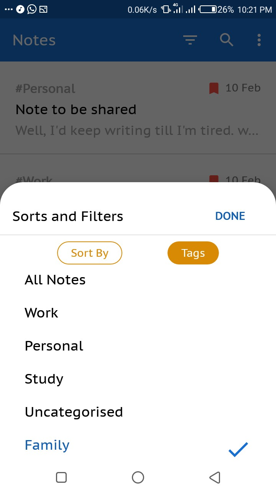

# Notes Application - Notes
This repository contains the code for a note keeping android app I built with Kotlin and the Android Mobile Framework. More details in the README

# The App

I know right?, a very boring name for an app, I am pretty lazy when it comes to naming things. Well, I decided to build this app after completing the Google-inspired Udacity Android Bootcamp for Kotlin Developers. I had also finished the **Kotlin Bootcamp** course months before that. It came as a challenge because I wanted to see what I could do with it. And here we are!!

Kotlin, by far is an amazing programming language as it eliminates most of the boilerplate that comes with Java, introduces more constructs that makes put code cleaner and more idiomatic. Apart from using Kotlin in this project, I also used some pretty interesting _thangs!!_

## Components 

* Android Mobile Framework
* Kotlin Programming Language
* MVVM Architecture
* Room - _Object Relational Mapper_
* Coroutines - _Background Operation_
* Material Design.

  
   
 
  

**Some features are still very much incomplete. I do hope to publish on Play Store before the end of this year - 11th Feb, 2020.**
